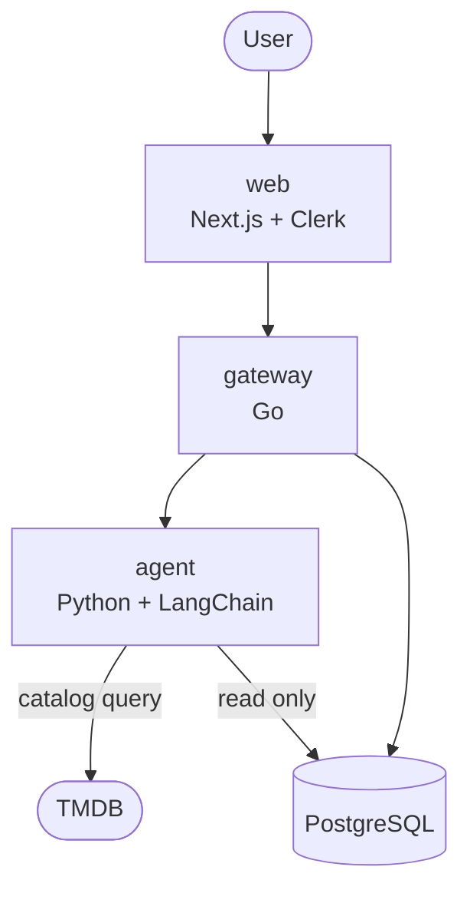

# Architecture

## System



REST between services. Each builds and deploys independently.

## What Holster does

Search and recommendation across the streaming services a user actually subscribes to.
Every service recommends from its own catalog; Holster recommends across all of them.

## Components

| Service | Language | Owns |
|---|---|---|
| `web` | TypeScript | UI, Clerk session |
| `gateway` | Go | The only endpoint the browser reaches. Verifies session, owns all writes |
| `agent` | Python | LangChain orchestration, TMDB catalog tools |

Three services and a database. There is no OAuth anywhere in the system: the streaming
services publish none, so there is nothing to connect to, and adding a provider that did
would mean reintroducing user tokens, refresh, encryption at rest and revocation.

## The thing this architecture is actually about

The agent executes **model-directed control flow over untrusted text**. Film overviews,
reviews and titles come from a public catalog anyone can edit, and user messages are
untrusted by definition. Any of it can carry instructions aimed at the model.

So the design assumes the agent will eventually be manipulated, and makes that
survivable rather than trying to prevent it:

- **The agent cannot write anything.** Every mutation — subscriptions, ratings,
  messages — goes through the gateway. The model has no path to a write.
- **The agent is not reachable from the internet.** Only the gateway is.
- **The agent holds only app-level secrets** — the TMDB key, the LLM provider key —
  neither of which opens any user's account. Losing one costs a key rotation, not a
  user.
- **Tools are a fixed menu, not an open door.** The agent picks from a declared list of
  catalog operations. It cannot compose an arbitrary request or reach an endpoint that
  is not on the list.

That last point is the load-bearing one. An open-ended "fetch this URL for me" tool
would be less code and would undo everything above.

## Trust boundaries

Boundaries follow blast radius, not code size.

**`gateway` is the only process the browser can reach.** It resolves the Clerk user ID
once, at the edge, and passes it inward. It owns every write to the database.

**`agent` is least trusted**, so it gets the narrowest surface: read-only database
access scoped to catalog and conversation tables, no internet exposure, no write path,
and only app-level keys.

**Database roles enforce this, not convention.** The agent connects as a role with no
`insert`, `update` or `delete` grant. A bug or an injected instruction hits a
permission error rather than a modified row.

**Sign-in is optional, and what it costs is stated honestly.** A guest reaches the
product without an account; everything user-scoped is a sign-in prompt rather than a
wall. Signing out lands in the product, signed out — never on an onboarding screen that
reads as though the account was wiped.

A guest's chat history dies with the socket and a reload starts over. Signing in carries
the provider picks and **not** the guest thread, which is why the prompt says "save
future chats" and must never promise to keep the current one.

**One socket per session.** A chat session holds a single WebSocket, shared across
conversation switches and reconnects, carrying messages up and curated events down. One
turn is *current* at a time, which is why the composer disables while streaming and why
turn ids — not connections — are what a reply is matched against; a superseded turn's
goroutine keeps running until it reports, so more than one can be outstanding.

An open socket is also what makes cancel unambiguous: a `cancel` frame naming a turn
arrives on the same line the turn was dispatched on, and aborting the agent's HTTP call
*is* the cancel — the agent needs no cancel protocol of its own. That only works because
the agent keeps no state between turns and has **no checkpointer**: a cancelled turn
would otherwise leave saved graph state holding a `tool_use` with no matching
`tool_result`, and the next message on that thread would resume into it and be rejected.

What the gateway persists is a curated view — clean text and the title ids shown — never
the agent's internals.

**A guest — a browser with no session — reaches only the catalog cache and the agent.**
`GET /guest/providers` and `/ws/chat?guest=1` are the whole browser-facing guest
surface; a socket with neither a ticket nor that flag is refused. (`GET /health` and
the Svix-signed `POST /webhooks/clerk` are also unauthenticated, but neither is
something a guest's browser calls.) A guest turn takes its streaming
services from the message, keeps history in memory for the life of the socket, and
persists nothing: there is no `users` row, so no user-scoped table is ever read or
written for it.

## Two classes of tool

**Catalog tools** — TMDB. One app-level key, no user connection, no per-user secret.
They work for every user on first load.

There is no second class. Connected tools requiring per-user OAuth were considered at
length and cut — the credential architecture they need is the thing this design exists
without.

## Flow: choosing streaming services

There is no OAuth for Netflix or Hulu — none is published. The user tells us what they
subscribe to, so this is a preference, not an authorization.

```
web     → gateway     ticked provider IDs
gateway → db          upsert streaming_subscriptions
```

Rows hold TMDB provider IDs and nothing secret. The list is self-reported and will
drift when someone cancels without un-ticking. The failure mode is recommending
something unwatchable, which is acceptable.

The list of available providers is cached in `streaming_providers`, refreshed lazily
on read when older than 24 hours, and served stale if TMDB is unreachable.

## Flow: asking a question

```
web         → gateway   message
gateway     → db        load subscriptions, country, every verdict
gateway     → agent     message + that context
agent       → tmdb      discover, filtered by subscriptions and region
agent       → gateway   answer
gateway     → db        persist the exchange
gateway     → web       answer
```

The gateway assembles the context and performs the writes. The agent receives what it
needs and returns text.

Verdicts and the already-shown set are the two pieces not windowed the way history is:
the agent needs every verdict to answer "has this user judged this title", and every
shown title to keep from re-offering one, so a cap on either quietly expires that
guarantee — for the heaviest users, and for the longest conversations.

## Where taste comes from

Holster has no external taste signal — no listening history, no cross-service viewing
data. It builds its own instead:

- **What you subscribe to** narrows the catalog to what you can actually watch.
- **What you say** carries mood, runtime, tone: *"something funny, under two hours,
  nothing bleak."*
- **What you tell us about titles** — liked, disliked, already seen, not interested —
  accumulates into a profile.

The third is the durable one, and it is a better predictor than the music history
originally planned, because film verdicts predict film taste and music does not.

## Regions

Streaming availability is country-specific — a title on Netflix in the US may be on a
different service in the UK. `users.country` is set at signup and every catalog query carries
`watch_region`, with one named exception: `/search/multi`, which accepts no region
parameter. The availability check that enriches each of its results does carry one,
so what a card claims about streaming is still country-scoped.

## Data model

```
users                     id (Clerk), email, country, created_at

streaming_providers       country, providers (jsonb), fetched_at
                          primary key (country) — a cache, not reference data

streaming_subscriptions   user_id, tmdb_provider_id, created_at
                          primary key (user_id, tmdb_provider_id)

title_verdicts            user_id, tmdb_id, media_type,
                          verdict ('liked' | 'disliked' | 'seen' | 'not_interested'
                                   | 'want_to_watch'),
                          created_at, verdict_set_at
                          primary key (user_id, tmdb_id, media_type)

conversations             user_id, title, created_at

messages                  conversation_id, role, content, title_refs,
                          created_at, seq
                          title_refs is the tmdb_id/media_type pairs shown in
                          an assistant turn's picks, null otherwise, and is
                          what an account's already-shown set is read back
                          from on every message. seq (an identity column) is
                          read order — a turn's user and assistant row share
                          one created_at
```

`users` rows are created on first authenticated request, not by Clerk, so an account
that never calls the gateway leaves no row. Everything user-scoped has a foreign key
to it.

**A locked judgment can be cleared, never overwritten in one step.** `want_to_watch`
is an intention with a lifecycle and stays mutable; the four judgments do not. Changing
one means clearing it and setting the new value — two steps, so a stale client cannot
silently replace a rating the user meant to keep.

No table holds a secret. Row-level security on every user-scoped table, keyed on the
Clerk user ID. `on delete cascade` throughout.

## Failure rules

Every surface follows these. They are invariants, not guidelines — a comment states
the rule it depends on and then cites this section, never the citation alone.

- **"Nothing matched" and "something broke" must never look alike.** Both produce an
  empty screen and they mean opposite things: one says *change your question*, the
  other *not your fault, try later*.
- **Never show a status code.** Each message says whether waiting will help: *"Can't
  reach the film database right now — give it a minute and try again"*, *"I'm having
  trouble thinking"*, *"Couldn't save that — try again"*.
- **Optimistic UI needs a rollback path.** Toggles and bookmarks show success before
  the server confirms. If a save fails and nothing reverts, the interface is lying.
- **A dropped stream keeps what arrived**, marks it incomplete, and offers a retry. It
  never stops mid-sentence looking finished.
- **A turn always ends in a terminal frame.** Whatever happens to a chat turn —
  success, supersede, deadline, a persist the user must know failed — the browser is
  told. Nothing is left silently unresolved.
- **Degrade rather than fail wherever there is stored data.** The provider cache keeps
  the picker working while TMDB is down. The chat is the exception: it cannot degrade,
  so if the model is unreachable, say so.

## Security properties

- No password reaches Holster.
- Holster holds no credential belonging to any other service, for any user.
- A database dump yields viewing preferences and chat logs — no account access
  anywhere, because there is none to leak.
- The agent cannot write to the database, reach the internet directly, or call an
  endpoint outside its declared tool list.

## Attribution

TMDB requires attribution and the free tier is non-commercial. The UI must carry the
TMDB logo and the notice *"This product uses the TMDb API but is not endorsed or
certified by TMDb"* in an About or Credits section. Watch-provider availability is
supplied by JustWatch and must be credited as their data.
