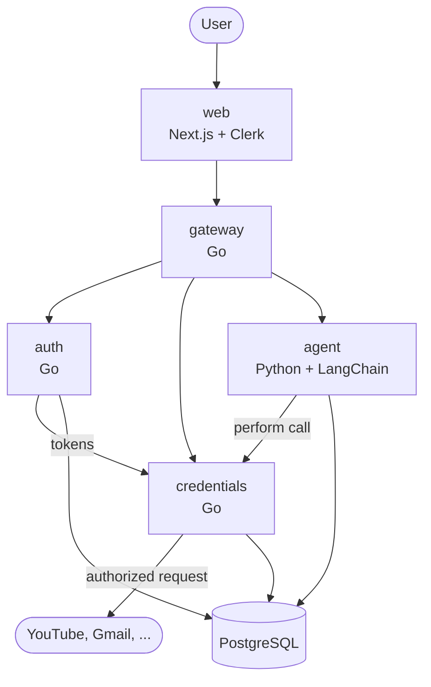

# Architecture

## System



REST between services. Each builds and deploys independently.

## Components

| Service | Language | Owns |
|---|---|---|
| `web` | TypeScript | UI, Clerk session |
| `gateway` | Go | The only endpoint the browser reaches. Verifies session, routes inward |
| `auth` | Go | OAuth flows with external providers. Stores nothing |
| `credentials` | Go | Encrypted token storage, refresh, authorized calls |
| `agent` | Python | LangChain orchestration, per-provider tools |

## Trust boundaries

Boundaries follow blast radius, not code size.

**`credentials` is the only service that can decrypt.** It alone reads
`CREDENTIALS_MASTER_KEY`. Callers ask it to *perform* an authorized request; they do
not receive tokens. This is why it is a service and not a library the agent imports —
a library would put the key in the agent's memory space.

**`auth` never persists a token.** It completes the OAuth exchange, forwards the token
pair to `credentials`, and drops it.

**`agent` is least trusted** — it executes model-directed control flow over user data —
so it gets the narrowest surface: no master key, no credential-table writes, no
ability to send on the user's behalf.

**The browser never holds an OAuth token.** It learns only *that* a service is
connected.

## Flow: connecting a service

```
web            → gateway → auth        user types "gmail", picks from results
auth           → web                   authorization URL (PKCE + state)
web            → provider              redirect; user authenticates there
provider       → auth                  callback with code
auth           → provider              exchange code for tokens
auth           → credentials           hand off token pair
credentials    → db                    encrypt, then insert
```

Holster never sees the password. MFA is the provider's concern.

## Flow: asking a question

```
web         → gateway      message
gateway     → agent        message + list of connected providers
agent                      builds tools from that list only
agent       → credentials  "search Gmail for X"
credentials → provider     authorized request (refreshes token first if expired)
credentials → agent        results — never the token
agent       → web          answer
```

The agent chooses the provider. There is no service picker in the UI.

## Token lifecycle

Access tokens are short-lived (~1h), refresh tokens long-lived.

On use, `credentials` checks `expires_at`, refreshes if needed, persists the new pair,
then proceeds. Users reconnect only if the refresh token is revoked at the provider.

## Encryption

Per-user key derived from the master key:

```
user_key = HMAC(CREDENTIALS_MASTER_KEY, user_id)
```

Tokens are encrypted under `user_key` before insert and decrypted only in memory at
call time. Rows for different users are encrypted under different keys, so a database
dump yields ciphertext under many keys rather than one.

Rotating the master key invalidates every stored token and forces reconnection.

## Data model

```
users                     id (Clerk), email, created_at

connected_services        user_id, provider, encrypted_access_token (bytea),
                          encrypted_refresh_token (bytea), expires_at, scopes
                          unique (user_id, provider)

conversations             user_id, title, created_at

messages                  conversation_id, role, content, created_at
```

Token columns are `bytea` and always ciphertext — no migration may add a `text` token
column. Row-level security on every user-scoped table, keyed on the Clerk user ID;
encryption is the second layer. `on delete cascade` throughout, so deleting a user
removes their tokens.

## Security properties

- No password reaches Holster.
- No plaintext token is written to disk or sent over the network.
- No token reaches the browser.
- A database dump does not yield account access.
- Nothing is written to a connected service without user approval.
