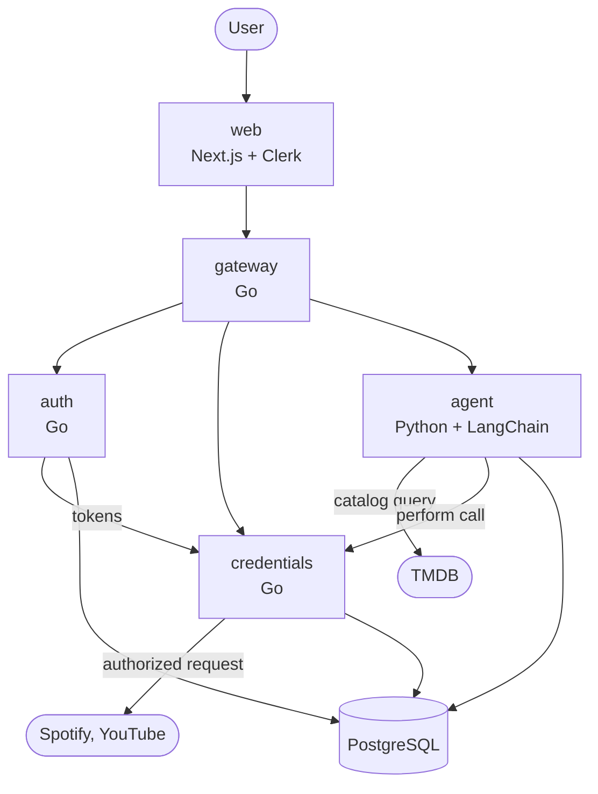

# Architecture

## System



REST between services. Each builds and deploys independently.

## What Holster does

Search and recommendation across the streaming services a user actually subscribes to.
Every service recommends from its own catalog; Holster recommends across all of them.

## Components

| Service | Language | Owns |
|---|---|---|
| `web` | TypeScript | UI, Clerk session |
| `gateway` | Go | The only endpoint the browser reaches. Verifies session, routes inward |
| `auth` | Go | OAuth flows with external providers. Stores nothing |
| `credentials` | Go | Encrypted token storage, refresh, authorized calls |
| `agent` | Python | LangChain orchestration, catalog and connected tools |

## Two classes of tool

The agent has two kinds of tool, and the difference decides where the secret lives.

**Catalog tools** — TMDB. One app-level key from the environment, held by the agent.
No user connection, no per-user secret. They work for every user on first load, which
is what keeps a brand-new account from meeting an agent that can do nothing.

**Connected tools** — Spotify, YouTube. Require a per-user OAuth token, so the agent
never calls the provider directly. It asks `credentials` to perform the request.

A question can span both: what to watch tonight is a catalog query, narrowed by the
user's subscriptions, nudged by what they have been listening to.

## Trust boundaries

Boundaries follow blast radius, not code size.

**`credentials` is the only service that can decrypt.** It alone reads
`CREDENTIALS_MASTER_KEY`. Callers ask it to *perform* an authorized request; they do
not receive tokens. This is why it is a service and not a library the agent imports —
a library would put the key in the agent's memory space.

**`auth` never persists a token.** It completes the OAuth exchange, forwards the token
pair to `credentials`, and drops it.

**`agent` is least trusted** — it executes model-directed control flow over user data —
so it gets the narrowest surface: no master key, no credential-table writes, no
ability to send on the user's behalf. Its one secret is the TMDB key, which is
app-level and grants access to nobody's account.

**The browser never holds an OAuth token.** It learns only *that* a service is
connected.

## Flow: choosing streaming services

There is no OAuth for Netflix or Hulu — none is published. The user tells us what they
subscribe to, so this is a preference, not an authorization.

```
web     → gateway     ticked provider IDs
gateway → db          upsert streaming_subscriptions
```

Rows hold TMDB provider IDs and nothing secret, so no encryption is involved. The list
is self-reported and will drift when someone cancels without un-ticking. The failure
mode is recommending something unwatchable, which is acceptable.

## Flow: connecting Spotify or YouTube

```
web            → gateway → auth        user picks a provider
auth           → web                   authorization URL (PKCE + state)
web            → provider              redirect; user authenticates there
provider       → auth                  callback with code
auth           → provider              exchange code for tokens
auth           → credentials           hand off token pair
credentials    → db                    encrypt, then insert
```

Holster never sees the password. MFA is the provider's concern. Scopes are read-only.

## Flow: asking a question

```
web         → gateway      message
gateway     → agent        message + subscriptions + connected providers
agent       → tmdb         catalog search, filtered by subscriptions and region
agent       → credentials  "recent listening for this user"   (only if connected)
credentials → provider     authorized request (refreshes token first if expired)
credentials → agent        results — never the token
agent       → web          answer
```

The agent chooses the tools. There is no service picker in the UI.

## Regions

Streaming availability is country-specific — a title on Netflix in the US may be on a
different service in the UK. `users.country` is set at signup and every catalog query
carries `watch_region`. Cheap to honour now, tedious to retrofit once queries are
scattered.

## Token lifecycle

Access tokens are short-lived (~1h), refresh tokens long-lived.

On use, `credentials` checks `expires_at`, refreshes if needed, persists the new pair,
then proceeds. Users reconnect only if the refresh token is revoked at the provider.

## Encryption

Per-user key derived from the master key:

```
user_key = HMAC(CREDENTIALS_MASTER_KEY, user_id)
```

Tokens are encrypted under `user_key` before insert and decrypted only in memory at
call time. Rows for different users are encrypted under different keys, so a database
dump yields ciphertext under many keys rather than one.

Rotating the master key invalidates every stored token and forces reconnection.

## Data model

```
users                     id (Clerk), email, country, created_at

streaming_subscriptions   user_id, tmdb_provider_id
                          primary key (user_id, tmdb_provider_id)

connected_services        user_id, provider, encrypted_access_token (bytea),
                          encrypted_refresh_token (bytea), expires_at, scopes
                          unique (user_id, provider)

conversations             user_id, title, created_at

messages                  conversation_id, role, content, created_at
```

`users` rows are created on first authenticated request, not by Clerk — see
[TASKS.md](../TASKS.md) T5.5. Everything user-scoped has a foreign key to it.

Token columns are `bytea` and always ciphertext — no migration may add a `text` token
column. `streaming_subscriptions` holds no secret and is deliberately plain. Row-level
security on every user-scoped table, keyed on the Clerk user ID; encryption is the
second layer. `on delete cascade` throughout, so deleting a user removes their tokens.

## Security properties

- No password reaches Holster.
- No plaintext token is written to disk or sent over the network.
- No token reaches the browser.
- A database dump does not yield account access.
- Every connected scope is read-only. The agent cannot write to a connected service.
