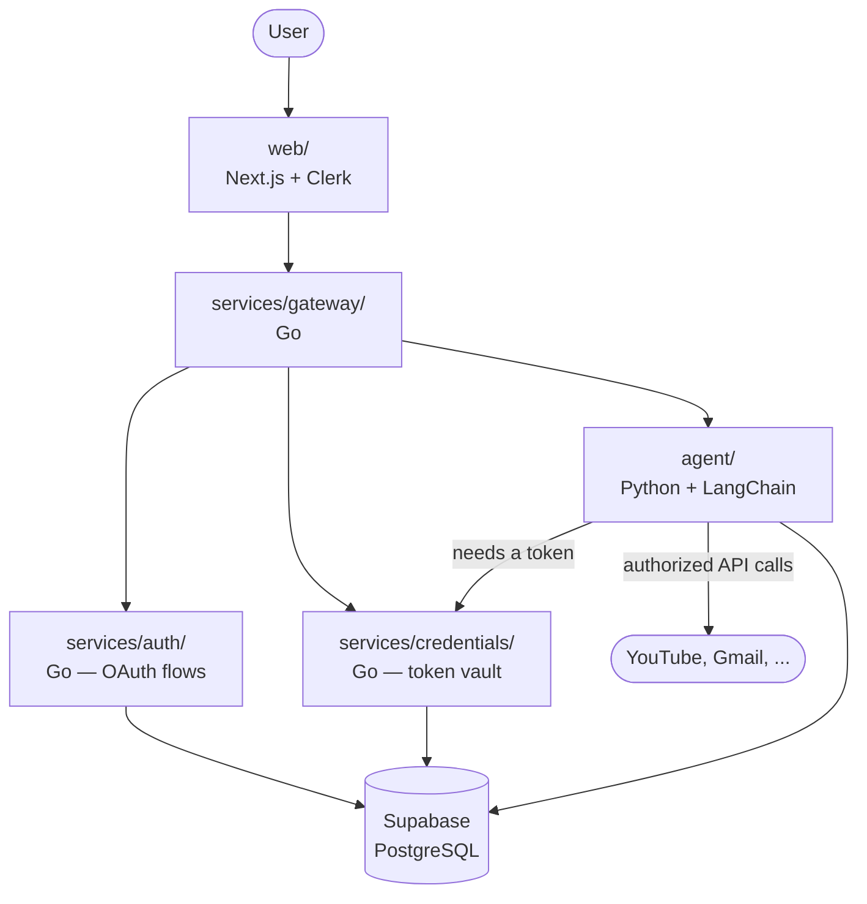

# Holster

A unified AI chat interface over the apps you already use.

Most apps have poor search. Netflix can't tell you what you'd actually want to watch
tonight, Instagram can't find that post your friend made last month, and YouTube's
search ignores half your subscriptions. Holster puts one conversation in front of all
of them: authorize an app once, then just ask.

## Status

Early. Scaffolding is in place; services are being built one at a time.

| Component | Stack | Status |
|---|---|---|
| `web/` | Next.js, TypeScript, Tailwind, shadcn/ui | Not started |
| `services/gateway/` | Go | Not started |
| `services/auth/` | Go | Not started |
| `services/credentials/` | Go | Not started |
| `agent/` | Python, FastAPI, LangChain | Not started |
| `db/` | Supabase (PostgreSQL) | Not started |

## Scope

Two features. Deliberately.

1. **Connections** — add and remove authorized apps. Adding is a search: type the app
   name, confirm it's the right one from its description, get redirected to that
   service's own OAuth screen, come back connected.
2. **Chat** — one conversation, no service picker. The agent has access to everything
   you've authorized and decides what to reach for based on what you asked.

Holster reads and researches. It can draft a reply for you to review. It never sends
anything on your behalf.

## Architecture



Services talk over REST. Each one is independently buildable and has its own
Dockerfile; `docker-compose.yml` wires them together for local development.

### Why separate services

The boundaries are drawn around *trust*, not around convenience:

- **`credentials/` is the only service that can decrypt a token.** Nothing else in the
  system holds the master key. The agent asks for an authorized client, not for
  secrets.
- **`auth/` is the only service that talks to external OAuth providers.** It hands
  tokens to `credentials/` and never stores them itself.
- **`agent/` runs model-directed code** — the least trusted component — so it gets the
  narrowest surface: it can request actions, never raw credentials.

That separation is the point of the project. A monolith would work; it just wouldn't
make these boundaries enforceable.

## Security

OAuth tokens are the entire risk surface here, so:

- **Holster never sees your password.** You authenticate on the provider's own domain.
  MFA, if you have it, is handled there and never touches this system.
- **Tokens are encrypted before they hit the database**, with a per-user key derived
  from a master key held only in `services/credentials/`. A dump of the database is
  not a dump of anyone's accounts.
- **Access tokens refresh in the background** and are never sent to the browser.
- **Nothing is written to a third-party service on your behalf** without you approving
  it first.

Secrets come from the environment. See `.env.example` — it lists every variable and
holds no real values. Never commit a filled-in `.env`.

## Getting started

```bash
git clone https://github.com/Skye967/holster.git
cd holster
cp .env.example .env    # fill in your own keys
docker compose up
```

> Services come online as they're built — see the status table above for what
> currently runs.

## Layout

```
holster/
├── web/                  Next.js frontend
├── services/
│   ├── gateway/          request routing and orchestration
│   ├── auth/             Clerk session verification + external OAuth
│   └── credentials/      encrypted token storage and refresh
├── agent/                LangChain agent and per-service tools
├── db/migrations/        Supabase schema
└── docs/                 architecture notes and decision records
```

## License

MIT
