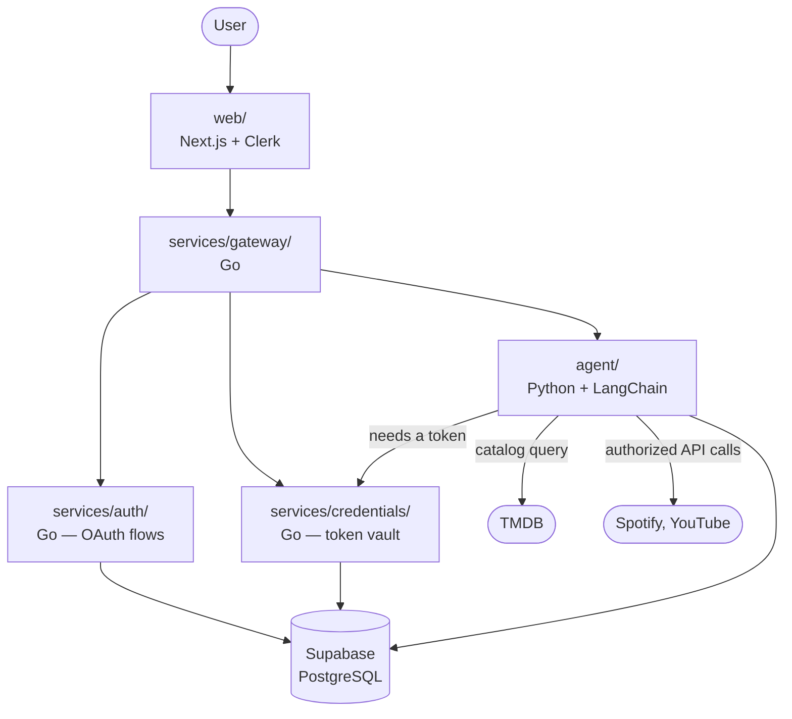

# Holster

Search and recommendation across the streaming services you actually subscribe to.

Every streaming service recommends from its own catalog. Netflix is structurally
incapable of telling you that the thing you'd like is on Hulu — so you pay for four
services and still scroll for twenty minutes. Holster puts one conversation in front of
all of them: say what you're in the mood for, get back something you can actually watch
tonight, on a service you already have.

## Status

Early. Scaffolding is in place; services are being built one at a time.

| Component | Stack | Status |
|---|---|---|
| `web/` | Next.js, TypeScript, Tailwind, shadcn/ui | Shell + auth done |
| `services/gateway/` | Go | Not started |
| `services/auth/` | Go | Not started |
| `services/credentials/` | Go | Not started |
| `agent/` | Python, FastAPI, LangChain | Not started |
| `db/` | Supabase (PostgreSQL) | Initial schema |

## Scope

Two features. Deliberately.

1. **Connections** — two kinds. Tick the streaming services you subscribe to (there is
   no OAuth for Netflix or Hulu; none is published). Separately, connect Spotify or
   YouTube over OAuth so recommendations know what you've been into.
2. **Chat** — one conversation, no service picker. The agent decides what to reach for
   based on what you asked.

Every connected scope is read-only. Holster reads and recommends; it never writes to a
connected service.

## Architecture



Services talk over REST. Each one is independently buildable and has its own
Dockerfile; `docker-compose.yml` wires them together for local development.

Boundaries are drawn around *trust*, not convenience — `credentials` is the only
service that can decrypt, `auth` stores nothing, and `agent` runs model-directed code
so it gets the narrowest surface. See **[ARCHITECTURE.md](ARCHITECTURE.md)** for the
request flows, token lifecycle, and data model.

## Security

OAuth tokens are the entire risk surface here, so:

- **Holster never sees your password.** You authenticate on the provider's own domain.
  MFA, if you have it, is handled there and never touches this system.
- **Tokens are encrypted before they hit the database**, with a per-user key derived
  from a master key held only in `services/credentials/`. A dump of the database is
  not a dump of anyone's accounts.
- **Access tokens refresh in the background** and are never sent to the browser.
- **Every scope is read-only.** Nothing is ever written to a connected service.

Secrets come from the environment. See `.env.example` — it lists every variable and
holds no real values. Never commit a filled-in `.env`.

## Getting started

```bash
git clone https://github.com/Skye967/holster.git
cd holster
cp .env.example .env    # fill in your own keys
docker compose up
```

> Services come online as they're built — see the status table above for what
> currently runs.

## Layout

```
holster/
├── web/                  Next.js frontend
├── services/
│   ├── gateway/          request routing and orchestration
│   ├── auth/             Clerk session verification + external OAuth
│   └── credentials/      encrypted token storage and refresh
├── agent/                LangChain agent and per-service tools
├── db/                   Schema reference
├── supabase/migrations/  Supabase migrations
└── ARCHITECTURE.md       services, trust boundaries, data model
```

## Credits

Catalog and streaming-availability data from [TMDB](https://www.themoviedb.org/) and
[JustWatch](https://www.justwatch.com/). This product uses the TMDB API but is not
endorsed or certified by TMDB.

## License

MIT
