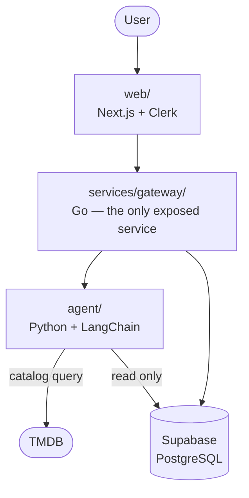

# Holster

Search and recommendation across the streaming services you actually subscribe to.

Every streaming service recommends from its own catalog. Netflix is structurally
incapable of telling you that the thing you'd like is on Hulu — so you pay for four
services and still scroll for twenty minutes. Holster puts one conversation in front of
all of them: say what you're in the mood for, get back something you can actually watch
tonight, on a service you already have.

## Status

MVP complete — chat, taste (verdicts), watchlist, and attribution are all built, and
the whole stack comes up from a single `docker compose up --build`.

| Component | Stack | Status |
|---|---|---|
| `web/` | Next.js, TypeScript, Tailwind, shadcn/ui | Built — in `docker-compose.yml` |
| `services/gateway/` | Go | Built — in `docker-compose.yml` |
| `agent/` | Python, FastAPI, LangChain | Built — in `docker-compose.yml` |
| `db/` | Supabase (PostgreSQL) | Schema + RLS in place |

## Scope

Two features. Deliberately.

1. **Subscriptions** — tick the streaming services you pay for. There is no OAuth for
   Netflix or Hulu; none is published, so this is a preference rather than a
   connection.
2. **Chat** — one conversation, no service picker. The agent decides what to reach for
   based on what you asked.

Holster holds no credential belonging to any other service. There is nothing to
connect, and nothing to leak.

## Architecture



Services talk over REST. Each one is independently buildable and has its own
Dockerfile; `docker-compose.yml` wires them together for local development.

See **[ARCHITECTURE.md](ARCHITECTURE.md)** for request flows, trust boundaries, and the
data model.

## Security

The interesting risk here is not credential storage — Holster stores no credentials.
It is that the agent runs **model-directed control flow over text anyone can edit**:
film overviews, reviews, and user messages, any of which can carry instructions aimed
at the model.

The design assumes the agent will eventually be manipulated and makes that survivable:

- **The agent cannot write anything.** Every mutation goes through the gateway. The
  agent's database role has no `insert`, `update` or `delete` grant, so a manipulated
  model hits a permission error rather than a modified row.
- **The agent is not reachable from the internet.** Only the gateway is exposed.
- **Tools are a fixed, declared list.** The agent picks operations from a menu and
  fills in permitted parameters. It cannot compose a request or name an endpoint.
- **The agent holds only app-level secrets** — the TMDB key, the LLM provider key —
  neither of which opens any user's account.
- **Holster never sees your password.** Sign-in is handled by Clerk on its own domain.

Secrets come from the environment. See `.env.example` — it lists every variable and
holds no real values. Never commit a filled-in `.env`.

## Getting started

```bash
git clone https://github.com/Skye967/holster.git
cd holster
cp .env.example .env       # fill in your own keys first — see below
docker compose up --build  # web, gateway, agent, postgres
```

Then open <http://localhost:3000>.

**Fill in `.env` before the first build.** The `NEXT_PUBLIC_*` values are compiled
into the frontend bundle rather than read at runtime, so `web/` checks them during the
build and rejects a placeholder — an invalid Clerk key would otherwise compile in
cleanly and then 500 every request. The gateway is stricter still and exits at startup
on any missing or malformed Clerk value, its webhook signing secret included. You need
a Clerk application, a TMDB key and a Google AI key; `.env.example` says where each
value comes from.

`--build` rather than a bare `up` for the same reason: editing a `NEXT_PUBLIC_*` value
only reaches the browser through a rebuild.

To work on the frontend with hot reload, stop the containerised frontend, bring the
backend up on its own, and run `web/` from the host:

```bash
docker compose stop web             # frees port 3000
docker compose up --build gateway   # pulls in agent, postgres and db-init
cd web && bun run dev               # serves the frontend at localhost:3000
```

`next dev` reads `web/.env*` and never the repo-root `.env`, so `web/.env.local` needs
its own copy of `NEXT_PUBLIC_CLERK_PUBLISHABLE_KEY` and `CLERK_SECRET_KEY`, plus
`NEXT_PUBLIC_GATEWAY_URL` set to wherever the gateway is published
(`http://localhost:8080` by default — compose derives that, `next dev` cannot). Leave
`GATEWAY_SERVICE_URL` out of it: that address only resolves inside compose, and on the
host both callers share one URL.

## Layout

```
holster/
├── web/                  Next.js frontend
├── services/
│   └── gateway/          request handling, all database writes
├── agent/                LangChain agent and catalog tools
├── db/                   Schema reference
├── supabase/migrations/  Supabase migrations
└── ARCHITECTURE.md       services, trust boundaries, data model
```

## Credits

Catalog and streaming-availability data from [TMDB](https://www.themoviedb.org/) and
[JustWatch](https://www.justwatch.com/). This product uses the TMDb API but is not
endorsed or certified by TMDb.

## License

MIT
